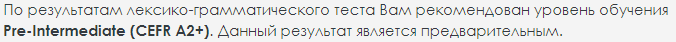

# **Aliaksandra Yahorushkina**
---
Junior Frontend Developer
---
### **Contact information:**
#### **E-mail:** egorushkina1a@gmail.com
**Instagram:** @egorishvili


---

### **Briefly About Myself:**
*From 2015 to 2020 I worked in the service sector, longest as a barista in a private company. At the same time, I drew illustrations, and in the summer of 2020, after the strike broke out during the Belarusian rallies, I quit my main job and went freelance.* 

*In 2021, I worked for a few months in a small company, copying and reselling mobile games.*

*Now I'm still doing illustration, but I want to move into the IT field because I don't feel I can compete with the emerging neural networks, which are getting better at generating images.*

---

### **Skills and Proficiency:**

* Git, GitHub
* JavaScript Basics
* Adobe Photoshop, Procreate, Adobe Illustrator

### **Code example:**
**This is an introductory task for CODEWARS:**
The code is not running properly. Try to understand why.

```

function multiply(a, b){
  a * b
}

```
Ответ:
```
function multiply(a, b){
  return a * b
}
```

### **Course:**
RS Schools Course «JavaScript/Front-end. Stage 0» (in progress)
 
### **languages:**
* English - pre-Intermediate A2
* Russian- native
* Belarussian - intermediate


